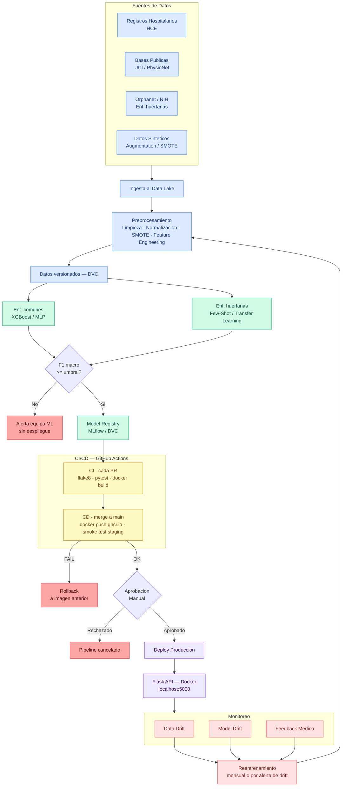
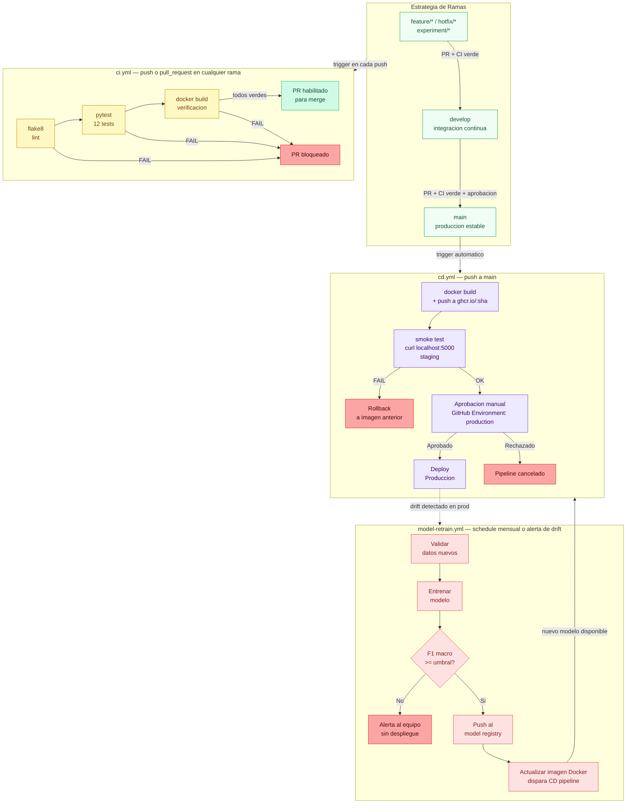

# Diagrama del Pipeline MLOps — Predicción de Enfermedades

## Diagrama 1 — Pipeline completo end-to-end

---

## Diagrama 2 — Detalle del pipeline CI/CD con GitHub Actions

---

> Los diagramas se renderizan automáticamente en GitHub. Para verlos localmente, usar [mermaid.live](https://mermaid.live).
